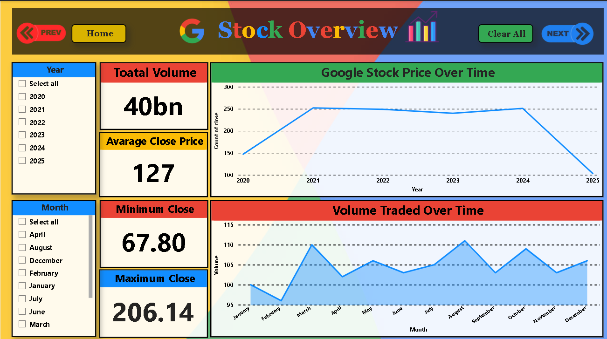
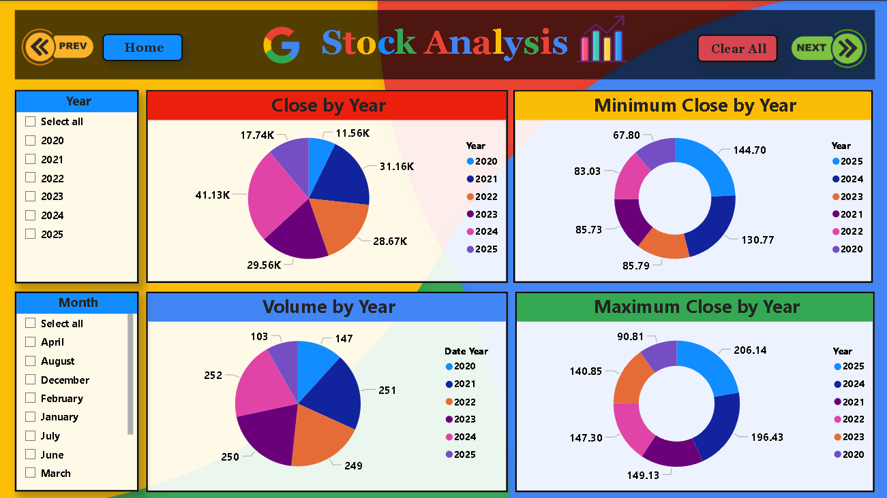
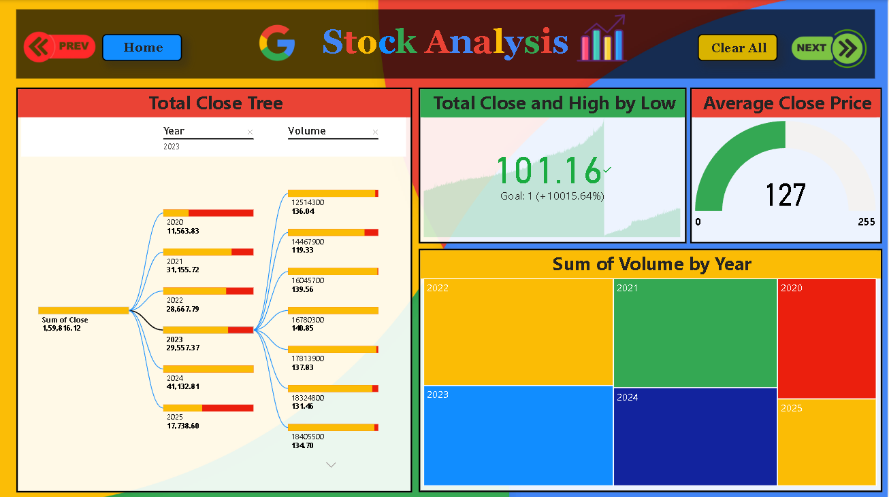

# 📈 Google Stock Power BI Dashboard

This repository contains an interactive Power BI report analyzing **Google (Alphabet Inc.) stock prices**. The dashboard includes multiple pages that explore closing price trends and insights using clean and interactive visuals.

---

## 🔍 Overview

This Power BI dashboard helps you:
- Visualize the **closing prices** of Google stock over time
- Identify **trends and patterns** in stock movement
- Navigate through **multiple report pages** for deeper insights

---

## 📁 Files Included

- `Google Stock.pbix` – Main Power BI dashboard file
- `preview1.png` to `preview4.png` – Dashboard page screenshots (see below)

---

## 💡 Tools Used

- **Power BI Desktop** – for data modeling & visualization
- **Yahoo Finance** or similar – for stock data source

---

## 🖼️ Dashboard Preview

### 📊 Page 1 – Overview / Main Chart

### 📊 Page 2 – Trend Analysis

### 📊 Page 3 – Comparison / Filters

### 📊 Page 4 – Summary or KPI View

---

## ▶️ How to Use

1. Download or clone this repository
2. Open the file `Google Stock.pbix` using **Power BI Desktop**
3. Navigate between pages and explore the dashboard interactively

---

## 🙋‍♂️ Author

**Akash**  
📎 [LinkedIn Profile]([https://www.linkedin.com/](https://www.linkedin.com/feed/?trk=guest_homepage-basic_google-one-tap-submit)) <!-- Replace with your actual link -->

---

## ⭐ Show Your Support

If you like this project, **star** this repo and share it with others!

---

